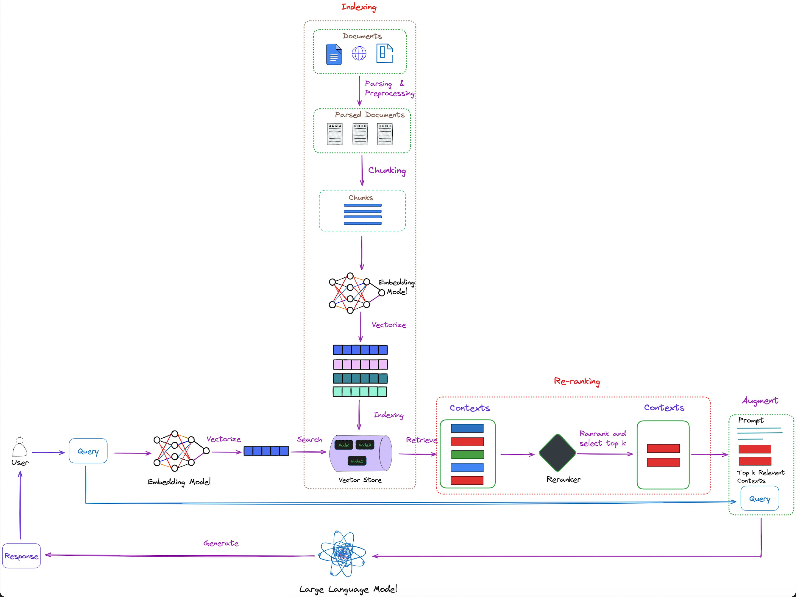

# Serverless Architecture on AWS for LLM Apps + RAG

This proposal outlines a cutting-edge serverless solution designed to streamline the continuous ingestion of files into a vector database, leveraging the robust capabilities of AWS and specialized technologies. Our solution is specifically engineered to support Large Language Models (LLMs) applications, such as Retrieval-Augmented Generation (RAG), by ensuring efficient data processing and storage in a scalable, cost-effective manner.

## Technical Overview

Our architecture harnesses the power of AWS services combined with advanced technologies to facilitate seamless file ingestion, processing, and storage into a Qdrant vector database. This infrastructure is designed to support high-volume, complex LLM applications by providing a resilient, scalable, and highly accessible data layer.

## Key Components of the Solution

### AWS S3 (Simple Storage Service)

Serves as the primary storage for incoming files, offering durability, scalability, and security. S3's robustness and flexibility make it the ideal choice for storing unstructured data files that will be ingested into the system.

### AWS Lambda Function

Acts as the backbone of our serverless architecture, triggered by new file uploads to S3. Lambda functions will process these files on-the-fly, extracting relevant content and metadata without the need for server provisioning or management, ensuring cost efficiency and scalability.

### AWS Textract

A fully managed machine learning (ML) service that automatically extracts text and data from scanned documents. Textract's integration enables our solution to handle a wide variety of document formats, converting them into usable data for further processing and analysis.

### Langchain

An advanced tool designed to facilitate the integration and application of LLMs within our architecture. Langchain will be utilized to preprocess the extracted data, making it suitable for storage and retrieval in the vector database, thus enhancing the capabilities of LLM applications.

### Qdrant

A high-performance vector database optimized for machine learning and similarity search. Our solution leverages Qdrant to store processed data, allowing for efficient data retrieval and management, crucial for powering LLM applications like RAG.

### LlamaIndex

LlamaIndex is an innovative indexing solution optimized for vector search operations within large-scale databases. It enhances the speed and accuracy of similarity searches, making it a valuable tool for improving the performance of applications reliant on vector database technologies.

### FAISS

FAISS is a library developed by Facebook AI Research, designed for efficient similarity search and clustering of dense vectors. It excels in handling large datasets, enabling rapid retrieval of items in high-dimensional spaces, making it ideal for applications requiring fast vector similarity.

